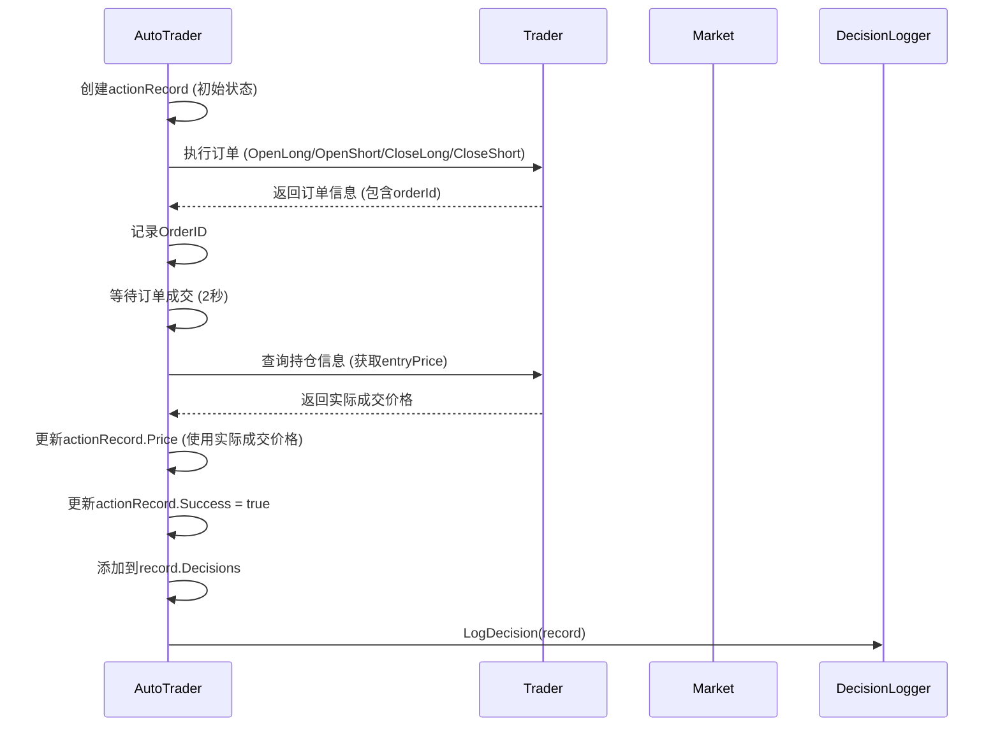

# Logger 订单信息记录机制

## 概述

Logger通过`DecisionAction`结构体记录所有订单信息，包括：
- **AI决策触发的订单**（open_long, open_short, close_long, close_short）
- **自动触发的止盈止损订单**（通过持仓变化检测）

## DecisionAction 结构体

```go
type DecisionAction struct {
    Action          string    `json:"action"`            // open_long, open_short, close_long, close_short
    Symbol          string    `json:"symbol"`            // 币种
    Quantity        float64   `json:"quantity"`          // 数量
    Leverage        int       `json:"leverage"`          // 杠杆（开仓时）
    Price           float64   `json:"price"`             // 执行价格
    OrderID         int64     `json:"order_id"`          // 订单ID
    Timestamp       time.Time `json:"timestamp"`         // 执行时间
    Success         bool      `json:"success"`           // 是否成功
    Error           string    `json:"error"`             // 错误信息
    IsAutoTriggered bool      `json:"is_auto_triggered"` // 是否自动触发（止盈止损）
    WasStopLoss     bool      `json:"was_stop_loss"`     // 是否止损（仅在自动触发时有效）
}
```

## 记录流程

### 1. AI决策触发的订单（Open/Close）

#### 流程概览



#### Open 订单记录流程

**代码位置**：`trader/auto_trader.go` - `executeOpenLongWithRecord` / `executeOpenShortWithRecord`

**关键步骤**：

1. **下单前记录初始信息**：
```go
// 获取当前市场价格
marketData, err := market.Get(decision.Symbol)
actionRecord.Price = marketData.CurrentPrice  // 初始价格
actionRecord.Quantity = decision.PositionSizeUSD / marketData.CurrentPrice
```

2. **执行订单**：
```go
order, err := at.trader.OpenLong(decision.Symbol, quantity, decision.Leverage)
if orderID, ok := order["orderId"].(int64); ok {
    actionRecord.OrderID = orderID  // 记录订单ID
}
```

3. **等待订单成交后获取实际价格**：
```go
time.Sleep(2 * time.Second)  // 等待订单成交
positions, err = at.trader.GetPositions()
for _, pos := range positions {
    if pos["symbol"] == decision.Symbol && pos["side"] == "long" {
        if entryPrice, ok := pos["entryPrice"].(float64); ok && entryPrice > 0 {
            actionRecord.Price = entryPrice  // ⚠️ 使用实际成交价格（entryPrice）
        }
    }
}
```

4. **记录杠杆**：
```go
actionRecord.Leverage = decision.Leverage
```

5. **标记成功**：
```go
actionRecord.Success = true
actionRecord.IsAutoTriggered = false  // AI决策触发，不是自动触发
```

#### Close 订单记录流程

**代码位置**：`trader/auto_trader.go` - `executeCloseLongWithRecord` / `executeCloseShortWithRecord`

**关键步骤**：

1. **平仓前记录持仓数量**：
```go
// ⚠️ 关键：在平仓前获取持仓数量并记录
positions, err := at.trader.GetPositions()
for _, pos := range positions {
    if pos["symbol"] == decision.Symbol && pos["side"] == "long" {
        positionAmt := pos["positionAmt"]
        // 类型安全处理（支持float64和string）
        actionRecord.Quantity = quantity  // 记录平仓数量
        if leverage, ok := pos["leverage"].(float64); ok {
            actionRecord.Leverage = int(leverage)  // 记录杠杆
        }
    }
}
```

2. **记录市场价格（初始价格）**：
```go
marketData, err := market.Get(decision.Symbol)
actionRecord.Price = marketData.CurrentPrice  // 初始价格，平仓后会更新
```

3. **执行平仓订单**：
```go
order, err := at.trader.CloseLong(decision.Symbol, 0)  // 0 = 全部平仓
if orderID, ok := order["orderId"].(int64); ok {
    actionRecord.OrderID = orderID  // 记录订单ID
}
```

4. **等待订单成交后获取实际价格**：
```go
time.Sleep(2 * time.Second)  // 等待订单成交
marketDataAfter, err := market.Get(decision.Symbol)
if err == nil {
    actionRecord.Price = marketDataAfter.CurrentPrice  // ⚠️ 使用成交后的市场价格
    log.Printf("✅ 已获取实际成交价格: %.2f (成交后市场价格)", marketDataAfter.CurrentPrice)
}
```

5. **标记成功**：
```go
actionRecord.Success = true
actionRecord.IsAutoTriggered = false  // AI决策触发，不是自动触发
```

### 2. 自动触发的止盈止损订单

#### 检测机制

**代码位置**：`trader/auto_trader.go` - `runCycle()` (第298-369行)

**检测逻辑**：

1. **比较上一个周期和当前周期的持仓**：
```go
// 构建当前持仓的key集合（symbol_side）
currentPositionKeys := make(map[string]bool)
for _, pos := range ctx.Positions {
    posKey := pos.Symbol + "_" + pos.Side
    currentPositionKeys[posKey] = true
}

// 检测消失的持仓
for _, lastPos := range at.lastCyclePositions {
    posKey := lastPos.Symbol + "_" + lastPos.Side
    if !currentPositionKeys[posKey] {
        // 持仓消失了，可能是自动触发的止盈止损订单
    }
}
```

2. **创建自动触发的close决策记录**：
```go
closeAction := logger.DecisionAction{
    Action:          "close_" + lastPos.Side,
    Symbol:          lastPos.Symbol,
    Quantity:        lastPos.Quantity,
    Leverage:        lastPos.Leverage,
    Price:           actualClosePrice,  // 使用当前市场价格作为实际成交价
    Timestamp:       time.Now(),
    Success:         true,
    IsAutoTriggered: true,  // ⚠️ 标记为自动触发
}
```

3. **判断是止损还是止盈**：
```go
wasStopLoss := false
if lastPos.Side == "long" {
    // 多仓：如果实际成交价低于开仓价，可能是止损
    priceDiff := actualClosePrice - lastPos.EntryPrice
    if priceDiff < -0.001 {  // 价格低于开仓价超过0.001，判断为止损
        wasStopLoss = true
    }
} else {
    // 空仓：如果实际成交价高于开仓价，可能是止损
    priceDiff := actualClosePrice - lastPos.EntryPrice
    if priceDiff > 0.001 {  // 价格高于开仓价超过0.001，判断为止损
        wasStopLoss = true
    }
}
closeAction.WasStopLoss = wasStopLoss
```

4. **添加到记录**：
```go
record.Decisions = append(record.Decisions, closeAction)
record.ExecutionLog = append(record.ExecutionLog,
    fmt.Sprintf("🔄 自动触发: %s %s (数量: %.4f, 价格: %.4f)",
        lastPos.Symbol, closeAction.Action, lastPos.Quantity, actualClosePrice))
```

#### 冲突处理

如果AI决策中有相同的close操作，会移除自动触发的记录（避免重复）：

```go
if d.Action == "close_long" || d.Action == "close_short" {
    // 从后往前遍历，查找并移除对应的自动触发记录
    for i := len(record.Decisions) - 1; i >= 0; i-- {
        existingAction := record.Decisions[i]
        if existingAction.IsAutoTriggered &&
            existingAction.Action == d.Action &&
            existingAction.Symbol == d.Symbol {
            // 移除自动触发的记录，因为AI决策会执行相同的操作
            record.Decisions = append(record.Decisions[:i], record.Decisions[i+1:]...)
            log.Printf("ℹ️  AI决策覆盖自动触发: %s %s", d.Symbol, d.Action)
            break
        }
    }
}
```

### 3. 错误处理

如果订单执行失败，会记录错误信息：

```go
if err := at.executeDecisionWithRecord(&d, &actionRecord); err != nil {
    log.Printf("❌ 执行决策失败 (%s %s): %v", d.Symbol, d.Action, err)
    actionRecord.Error = err.Error()
    actionRecord.Success = false
    record.ExecutionLog = append(record.ExecutionLog, 
        fmt.Sprintf("❌ %s %s 失败: %v", d.Symbol, d.Action, err))
} else {
    actionRecord.Success = true
    record.ExecutionLog = append(record.ExecutionLog, 
        fmt.Sprintf("✓ %s %s 成功", d.Symbol, d.Action))
}
```

## 关键字段说明

### Price（价格）

- **Open订单**：使用实际成交价格（entryPrice），通过查询持仓信息获取
- **Close订单**：使用成交后的市场价格，通过查询市场数据获取
- **自动触发订单**：使用当前市场价格作为近似值

### Quantity（数量）

- **Open订单**：根据`position_size_usd`和市场价格计算
- **Close订单**：在平仓前从持仓信息中获取（支持float64和string类型）
- **自动触发订单**：使用上一周期的持仓数量

### OrderID（订单ID）

- **AI决策订单**：从订单返回结果中提取
- **自动触发订单**：为0（因为无法获取订单ID，订单可能已经成交）

### IsAutoTriggered（是否自动触发）

- **AI决策订单**：`false`
- **自动触发订单**：`true`

### WasStopLoss（是否止损）

- **仅在自动触发时有效**：通过价格对比判断是止损还是止盈
- **AI决策订单**：始终为`false`

## JSON示例

### AI决策触发的Open订单

```json
{
  "action": "open_long",
  "symbol": "BTCUSDT",
  "quantity": 0.00448,
  "leverage": 10,
  "price": 101657.0,
  "order_id": 123456789,
  "timestamp": "2025-11-05T16:37:49Z",
  "success": true,
  "error": "",
  "is_auto_triggered": false,
  "was_stop_loss": false
}
```

### AI决策触发的Close订单

```json
{
  "action": "close_long",
  "symbol": "BTCUSDT",
  "quantity": 0.00448,
  "leverage": 10,
  "price": 101556.0,
  "order_id": 123456790,
  "timestamp": "2025-11-05T16:42:37Z",
  "success": true,
  "error": "",
  "is_auto_triggered": false,
  "was_stop_loss": false
}
```

### 自动触发的止盈订单

```json
{
  "action": "close_short",
  "symbol": "BTCUSDT",
  "quantity": 0.00448,
  "leverage": 10,
  "price": 101556.0,
  "order_id": 0,
  "timestamp": "2025-11-05T16:42:37Z",
  "success": true,
  "error": "",
  "is_auto_triggered": true,
  "was_stop_loss": false
}
```

### 自动触发的止损订单

```json
{
  "action": "close_long",
  "symbol": "ETHUSDT",
  "quantity": 0.1,
  "leverage": 5,
  "price": 3200.0,
  "order_id": 0,
  "timestamp": "2025-11-05T16:42:37Z",
  "success": true,
  "error": "",
  "is_auto_triggered": true,
  "was_stop_loss": true
}
```

### 执行失败的订单

```json
{
  "action": "open_long",
  "symbol": "BTCUSDT",
  "quantity": 0.00448,
  "leverage": 10,
  "price": 101657.0,
  "order_id": 0,
  "timestamp": "2025-11-05T16:37:49Z",
  "success": false,
  "error": "❌ BTCUSDT 已有多仓，拒绝开仓以防止仓位叠加超限",
  "is_auto_triggered": false,
  "was_stop_loss": false
}
```

## 关键设计点

### 1. 实际成交价格获取

- **Open订单**：等待2秒后查询持仓信息，获取entryPrice（真实成交价格）
- **Close订单**：等待2秒后查询市场价格，使用成交后的市场价格作为近似值

### 2. 数量记录时机

- **Open订单**：下单时计算并记录
- **Close订单**：**平仓前**从持仓信息中获取（关键！）

### 3. 自动触发检测

- **检测时机**：在AI决策执行前，通过比较上一个周期和当前周期的持仓
- **价格获取**：使用当前市场价格作为实际成交价的近似值
- **止损判断**：通过价格对比判断（存在容差，避免微小波动误判）

### 4. 冲突处理

- 如果AI决策中有相同的close操作，会移除自动触发的记录
- 确保每个订单只记录一次

## 总结

Logger通过以下机制记录订单信息：

1. **AI决策订单**：在执行订单前后记录详细信息（价格、数量、订单ID等）
2. **自动触发订单**：通过持仓变化检测，记录止盈止损订单
3. **错误处理**：记录执行失败的订单和错误信息
4. **实际成交价格**：通过等待和查询获取真实成交价格，而不是下单时的市场价格

所有订单信息都保存在`DecisionRecord.Decisions`数组中，最终通过`LogDecision()`保存到JSON文件。

