# Logger 逻辑时序图

## 完整流程时序图

```mermaid
sequenceDiagram
    participant AT as AutoTrader
    participant DL as DecisionLogger
    participant CTX as Context
    participant DE as DecisionEngine
    participant FS as FileSystem
    participant AI as AI API

    Note over AT,FS: ========== 初始化阶段 ==========
    
    AT->>DL: NewDecisionLogger(logDir)
    DL->>FS: MkdirAll(logDir, 0755)
    FS-->>DL: 目录创建成功/失败
    DL->>FS: ReadDir(logDir)
    FS-->>DL: 文件列表
    DL->>DL: 解析文件名，找最大cycle number
    DL-->>AT: DecisionLogger实例(cycleNumber已恢复)
    
    Note over AT,FS: ========== 交易周期开始 ==========
    
    AT->>AT: runCycle() 开始
    AT->>AT: 创建 DecisionRecord (初始状态)
    
    Note over AT,FS: ========== 构建交易上下文 ==========
    
    AT->>AT: buildTradingContext()
    AT->>AT: 获取账户信息、持仓信息
    AT->>DL: GetLogDir()
    DL-->>AT: logDir路径
    AT->>DL: AnalyzePerformance(100)
    DL->>DL: GetLatestRecords(100)
    DL->>FS: ReadDir(logDir)
    FS-->>DL: 文件列表
    loop 读取文件
        DL->>FS: ReadFile(filepath)
        FS-->>DL: JSON内容
        DL->>DL: Unmarshal JSON
    end
    DL->>DL: 反转数组(旧→新)
    DL->>DL: 分析交易表现
    DL-->>AT: PerformanceAnalysis
    AT->>CTX: 构建Context (包含LogDir)
    
    Note over AT,FS: ========== 检测自动触发的止盈止损 ==========
    
    AT->>AT: 比较lastCyclePositions和当前持仓
    alt 发现持仓消失
        AT->>AT: 创建自动触发的close决策记录
        AT->>AT: 添加到record.Decisions
    end
    
    Note over AT,FS: ========== 保存账户快照 ==========
    
    AT->>AT: 保存AccountSnapshot到record
    AT->>AT: 保存PositionSnapshot到record
    AT->>AT: 保存CandidateCoins到record
    
    Note over AT,FS: ========== 调用AI决策 ==========
    
    AT->>DE: GetFullDecisionWithCustomPrompt(ctx, ...)
    DE->>DE: buildUserPrompt(ctx)
    
    Note over DE,FS: ========== 读取历史思维链 ==========
    
    alt ctx.LogDir != ""
        DE->>DL: NewDecisionLogger(ctx.LogDir)
        DL->>FS: MkdirAll(logDir, 0755)
        DL->>FS: ReadDir(logDir)
        FS-->>DL: 文件列表
        DL->>DL: GetLatestRecords(2)
        loop 读取最近2个文件
            DL->>FS: ReadFile(filepath)
            FS-->>DL: JSON内容
            DL->>DL: Unmarshal JSON
        end
        DL->>DL: 反转数组(旧→新)
        DL-->>DE: records[] (从旧到新)
        DE->>DE: 提取CoTTrace，添加到userPrompt
    end
    
    DE->>DE: buildSystemPrompt()
    DE->>AI: CallWithMessages(systemPrompt, userPrompt)
    AI-->>DE: AI响应(包含思维链和JSON决策)
    DE->>DE: parseFullDecisionResponse()
    DE->>DE: 提取CoTTrace和Decisions
    DE-->>AT: FullDecision (包含CoTTrace, Decisions, SystemPrompt, UserPrompt)
    
    Note over AT,FS: ========== 保存AI决策信息 ==========
    
    AT->>AT: record.SystemPrompt = decision.SystemPrompt
    AT->>AT: record.InputPrompt = decision.UserPrompt
    AT->>AT: record.CoTTrace = decision.CoTTrace
    AT->>AT: record.DecisionJSON = json.Marshal(decision.Decisions)
    
    Note over AT,FS: ========== 执行AI决策 ==========
    
    loop 遍历每个决策
        AT->>AT: executeDecisionWithRecord()
        AT->>AT: 执行交易操作
        alt 执行成功
            AT->>AT: actionRecord.Success = true
            AT->>AT: 记录执行日志
        else 执行失败
            AT->>AT: actionRecord.Success = false
            AT->>AT: actionRecord.Error = err.Error()
            AT->>AT: 记录错误日志
        end
        AT->>AT: record.Decisions.append(actionRecord)
    end
    
    Note over AT,FS: ========== 保存决策记录到文件 ==========
    
    AT->>DL: LogDecision(record)
    DL->>DL: cycleNumber++ (递增)
    DL->>DL: record.CycleNumber = cycleNumber
    DL->>DL: record.Timestamp = time.Now()
    DL->>DL: 生成文件名: decision_YYYYMMDD_HHMMSS_cycleN.json
    DL->>DL: json.MarshalIndent(record)
    DL->>FS: WriteFile(filepath, data, 0644)
    FS-->>DL: 写入成功/失败
    DL-->>AT: 成功/错误
    
    Note over AT,FS: ========== 更新状态 ==========
    
    AT->>AT: lastCyclePositions = currentPositionsCopy
    AT->>AT: 周期结束
```



## 关键逻辑检查点

### 1. Cycle Number 管理

**初始化时的恢复逻辑**：
```go
// 从日志文件中恢复cycle number（找到最大的cycle number）
cycleNumber := 0
files, err := ioutil.ReadDir(logDir)
for _, file := range files {
    var cycle int
    _, err := fmt.Sscanf(file.Name(), "decision_%*s_cycle%d.json", &cycle)
    if err == nil && cycle > cycleNumber {
        cycleNumber = cycle
    }
}
```

**记录时的递增逻辑**：
```go
func (l *DecisionLogger) LogDecision(record *DecisionRecord) error {
    l.cycleNumber++  // ⚠️ 关键：先递增，再赋值
    record.CycleNumber = l.cycleNumber
    record.Timestamp = time.Now()
    // ...
}
```

**潜在问题检查**：
- ✅ **正确**：先递增再赋值，确保cycle number单调递增
- ✅ **正确**：初始化时从文件恢复最大cycle number，避免重复
- ⚠️ **注意**：如果多个AutoTrader实例共享同一个logDir，可能出现cycle number冲突

### 2. 历史记录读取逻辑

**GetLatestRecords 的排序逻辑**：
```go
// 先按修改时间倒序收集（最新的在前）
for i := len(files) - 1; i >= 0 && count < n; i-- {
    // 读取文件...
    records = append(records, &record)
}

// 反转数组，让时间从旧到新排列（用于图表显示）
for i, j := 0, len(records)-1; i < j; i, j = i+1, j-1 {
    records[i], records[j] = records[j], records[i]
}
```

**潜在问题检查**：
- ✅ **正确**：使用文件修改时间排序，不受文件名影响
- ✅ **正确**：最终返回从旧到新的顺序，符合历史回顾的逻辑
- ⚠️ **注意**：依赖文件系统的修改时间，如果文件被外部修改可能导致顺序错误

### 3. 历史思维链读取

**buildUserPrompt 中的读取逻辑**：
```go
if ctx.LogDir != "" {
    decisionLogger := logger.NewDecisionLogger(ctx.LogDir)  // ⚠️ 每次创建新实例
    records, err := decisionLogger.GetLatestRecords(2)
    // 从新到旧显示（records已经是按时间从旧到新排列，需要反转）
    for i := len(records) - 1; i >= 0; i-- {
        record := records[i]
        if record.CoTTrace != "" {
            // 添加到prompt
        }
    }
}
```

**潜在问题检查**：
- ✅ **正确**：检查LogDir是否为空，避免无效操作
- ✅ **正确**：检查CoTTrace是否为空，只显示有内容的记录
- ⚠️ **性能问题**：每次调用都创建新的DecisionLogger实例，但影响较小（毫秒级）
- ⚠️ **时序问题**：当前cycle还未保存，GetLatestRecords(2)会返回前2个已保存的cycle，逻辑正确

### 4. 自动触发止盈止损检测

**检测逻辑**：
```go
// 比较上一个周期的持仓和当前持仓
if len(at.lastCyclePositions) > 0 {
    // 构建当前持仓的key集合
    currentPositionKeys := make(map[string]bool)
    for _, pos := range ctx.Positions {
        posKey := pos.Symbol + "_" + pos.Side
        currentPositionKeys[posKey] = true
    }
    
    // 检测消失的持仓
    for _, lastPos := range at.lastCyclePositions {
        posKey := lastPos.Symbol + "_" + lastPos.Side
        if !currentPositionKeys[posKey] {
            // 创建自动触发的close决策记录
        }
    }
}
```

**潜在问题检查**：
- ✅ **正确**：使用symbol_side作为key，区分多空持仓
- ✅ **正确**：在AI决策执行前检测，确保能记录到自动触发的操作
- ✅ **正确**：如果AI决策中有相同的close操作，会移除自动触发的记录（避免重复）

### 5. 决策记录保存时机

**保存时机分析**：
1. **风险控制暂停**：立即保存（不执行交易）
2. **构建上下文失败**：立即保存（记录错误）
3. **AI决策失败**：保存思维链和错误信息
4. **正常执行**：执行完所有决策后保存

**潜在问题检查**：
- ✅ **正确**：所有路径都会调用LogDecision，确保记录完整
- ✅ **正确**：即使AI决策失败，也会保存已获取的思维链和prompt
- ⚠️ **注意**：如果LogDecision失败，只打印警告，不会中断交易流程

### 6. 文件命名和并发安全

**文件命名格式**：
```go
filename := fmt.Sprintf("decision_%s_cycle%d.json",
    record.Timestamp.Format("20060102_150405"),
    record.CycleNumber)
```

**潜在问题检查**：
- ✅ **正确**：使用时间戳+cycle number，避免文件名冲突
- ⚠️ **并发问题**：如果同一秒内有多个周期，可能生成相同的时间戳（但cycle number不同，仍可区分）
- ⚠️ **并发问题**：多个goroutine同时写入同一目录可能有问题（但通常只有一个AutoTrader实例）

## 总结

### ✅ 正确实现的逻辑

1. **Cycle Number管理**：从文件恢复，单调递增，逻辑正确
2. **历史记录读取**：按修改时间排序，返回从旧到新的顺序
3. **自动触发检测**：在AI决策前检测，避免重复记录
4. **错误处理**：所有路径都有错误处理和记录保存

### ⚠️ 需要注意的问题

1. **性能优化**（低优先级）：
   - `buildUserPrompt`中每次创建新的DecisionLogger实例
   - 可以考虑缓存，但影响很小（毫秒级）

2. **并发安全**（中等优先级）：
   - 如果多个AutoTrader实例共享logDir，可能出现cycle number冲突
   - 当前设计是每个trader有独立的logDir，问题不大

3. **文件系统依赖**（低优先级）：
   - GetLatestRecords依赖文件修改时间，如果文件被外部修改可能影响顺序
   - 但通常不会发生这种情况

### 7. LogDecision 调用路径检查

**调用位置分析**：
```go
// 路径1: 风险控制暂停（第278行）
if time.Now().Before(at.stopUntil) {
    record.Success = false
    at.decisionLogger.LogDecision(record)
    return nil  // ⚠️ 提前返回，不会执行后续代码
}

// 路径2: 构建上下文失败（第294行）
ctx, err := at.buildTradingContext()
if err != nil {
    record.Success = false
    at.decisionLogger.LogDecision(record)
    return fmt.Errorf(...)  // ⚠️ 提前返回，不会执行后续代码
}

// 路径3: 获取AI决策失败（第445行）
if err != nil {
    record.Success = false
    at.decisionLogger.LogDecision(record)
    return fmt.Errorf(...)  // ⚠️ 提前返回，不会执行后续代码
}

// 路径4: 正常执行（第529行）
if err := at.decisionLogger.LogDecision(record); err != nil {
    log.Printf("⚠ 保存决策记录失败: %v", err)
}
```

**潜在问题检查**：
- ✅ **正确**：每个`runCycle`只会在一个路径上调用`LogDecision`
- ✅ **正确**：所有提前返回的路径都会先调用`LogDecision`，确保记录完整
- ✅ **正确**：即使AI决策失败，也会保存已获取的思维链和prompt
- ⚠️ **注意**：如果LogDecision失败，只打印警告，不会中断交易流程（这是合理的，因为不应该因为日志失败而中断交易）

### 🔧 建议改进（可选）

1. **添加文件锁**：如果将来需要支持多实例共享logDir，可以添加文件锁
2. **缓存DecisionLogger**：在Context中缓存DecisionLogger实例，减少创建开销
3. **添加校验**：在LogDecision时验证cycle number的连续性
4. **添加重试机制**：如果LogDecision失败，可以考虑重试（但当前实现只打印警告，也是合理的）

但这些改进都不是必须的，当前实现已经足够健壮和正确。

