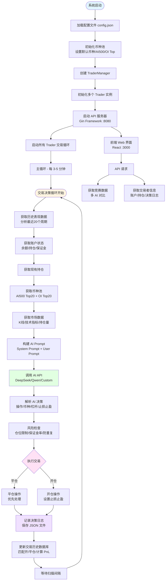
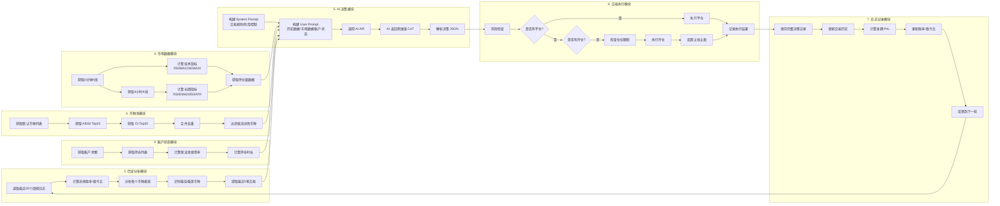
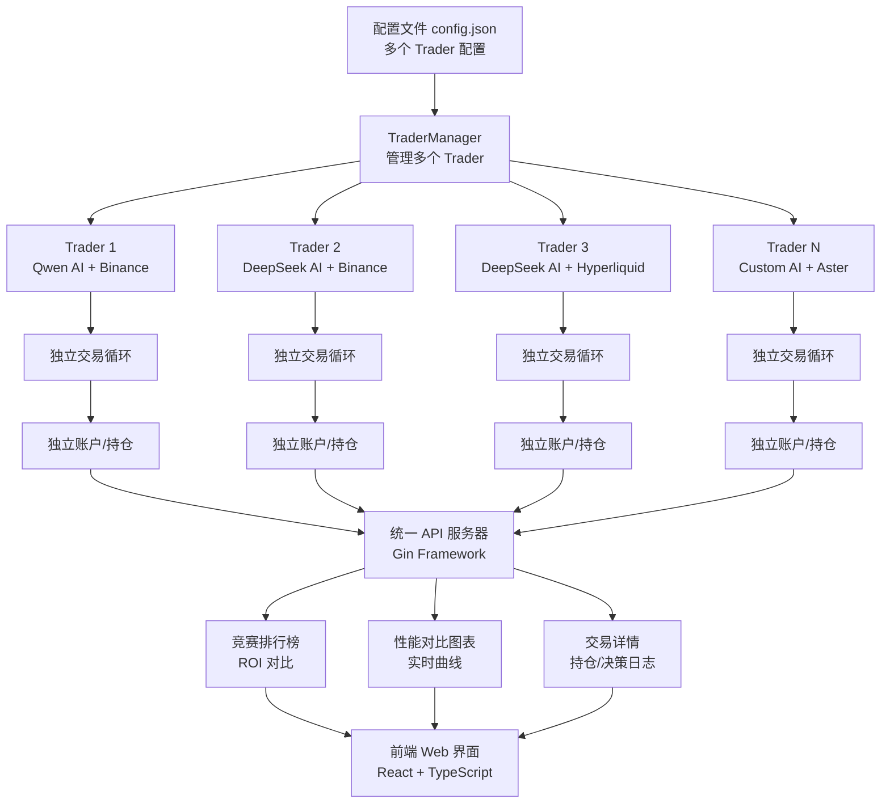
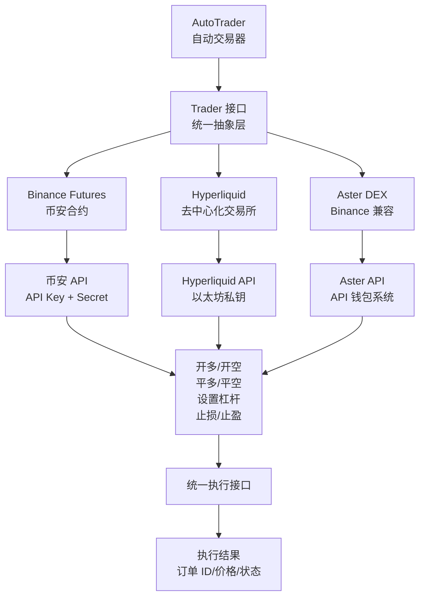
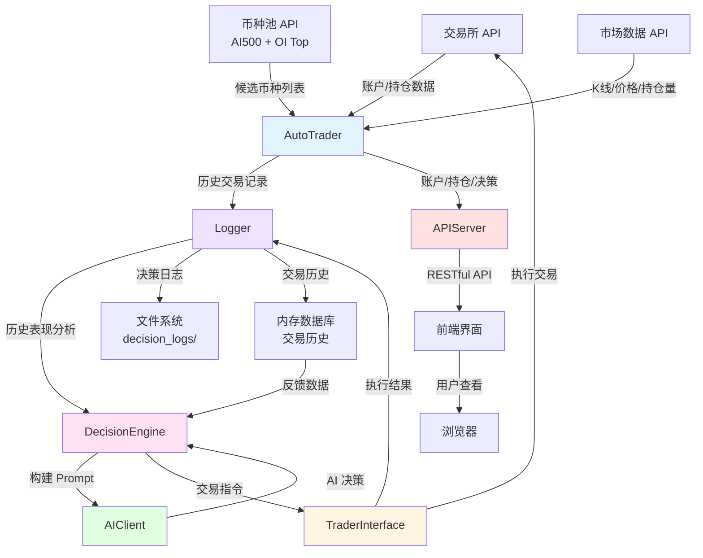
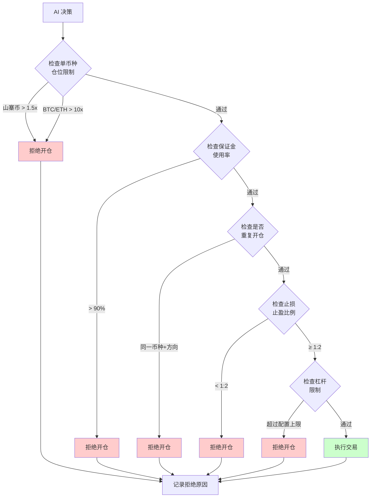
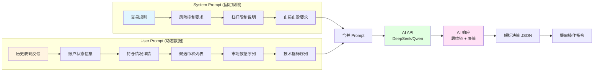

# NOFX 系统架构流程图

## 整体系统架构

```mermaid
graph TB
    Start([系统启动]) --> LoadConfig[加载配置文件 config.json]
    LoadConfig --> InitPool[初始化币种池<br/>设置默认币种/AI500/OI Top]
    InitPool --> CreateManager[创建 TraderManager]
    CreateManager --> InitTraders[初始化多个 Trader 实例]
    InitTraders --> StartAPI[启动 API 服务器<br/>Gin Framework :8080]
    StartAPI --> StartTraders[启动所有 Trader 交易循环]
    StartTraders --> MainLoop[主循环 - 每 3-5 分钟]
    
    MainLoop --> CycleStart([交易决策循环开始])
    CycleStart --> GetHistory[获取历史表现数据<br/>分析最近20个周期]
    GetHistory --> GetAccount[获取账户状态<br/>余额/持仓/保证金]
    GetAccount --> GetPositions[获取现有持仓]
    GetPositions --> GetCoinPool[获取币种池<br/>AI500 Top20 + OI Top20]
    GetCoinPool --> GetMarketData[获取市场数据<br/>K线/技术指标/持仓量]
    GetMarketData --> BuildPrompt[构建 AI Prompt<br/>System Prompt + User Prompt]
    BuildPrompt --> CallAI[调用 AI API<br/>DeepSeek/Qwen/Custom]
    CallAI --> ParseDecision[解析 AI 决策<br/>操作/币种/杠杆/止损止盈]
    ParseDecision --> RiskCheck[风险检查<br/>仓位限制/保证金率/防重复]
    RiskCheck --> ExecuteTrade{执行交易}
    ExecuteTrade -->|平仓| ClosePos[平仓操作<br/>优先处理]
    ExecuteTrade -->|开仓| OpenPos[开仓操作<br/>设置止损止盈]
    ClosePos --> LogDecision[记录决策日志<br/>保存 JSON 文件]
    OpenPos --> LogDecision
    LogDecision --> UpdateDB[更新交易历史数据库<br/>匹配开/平仓/计算 PnL]
    UpdateDB --> WaitInterval[等待扫描间隔]
    WaitInterval --> CycleStart
    
    StartAPI --> WebUI[前端 Web 界面<br/>React :3000]
    WebUI --> APIReq[API 请求]
    APIReq --> GetCompetition[获取竞赛数据<br/>多 AI 对比]
    APIReq --> GetTraderInfo[获取交易者信息<br/>账户/持仓/决策日志]
    
    style Start fill:#e1f5ff
    style CycleStart fill:#fff4e1
    style ExecuteTrade fill:#ffe1f5
    style CallAI fill:#e1ffe1
    style LogDecision fill:#f0e1ff
```

## 详细决策流程

```mermaid
graph LR
    subgraph "1. 历史分析模块"
        A1[读取最近20个周期日志] --> A2[计算总体胜率/盈亏比]
        A2 --> A3[分析每个币种表现]
        A3 --> A4[识别最佳/最差币种]
        A4 --> A5[提取最近5笔交易]
    end
    
    subgraph "2. 账户状态模块"
        B1[获取账户余额] --> B2[获取持仓列表]
        B2 --> B3[计算保证金使用率]
        B3 --> B4[计算持仓时长]
    end
    
    subgraph "3. 币种池模块"
        C1[获取默认币种列表] --> C2[获取 AI500 Top20]
        C2 --> C3[获取 OI Top20]
        C3 --> C4[合并去重]
        C4 --> C5[过滤低流动性币种]
    end
    
    subgraph "4. 市场数据模块"
        D1[获取3分钟K线] --> D2[计算技术指标<br/>RSI/MACD/EMA20]
        D1 --> D3[获取4小时K线]
        D3 --> D4[计算长期指标<br/>RSI/EMA20/50/ATR]
        D2 --> D5[获取持仓量数据]
        D4 --> D5
    end
    
    subgraph "5. AI 决策模块"
        E1[构建 System Prompt<br/>交易规则/风险控制] --> E2[构建 User Prompt<br/>历史数据/市场数据/账户状态]
        E2 --> E3[调用 AI API]
        E3 --> E4[AI 返回思维链 CoT]
        E4 --> E5[解析决策 JSON]
    end
    
    subgraph "6. 交易执行模块"
        F1[风险检查] --> F2{是否有平仓?}
        F2 -->|是| F3[执行平仓]
        F2 -->|否| F4{是否有开仓?}
        F4 -->|是| F5[检查仓位限制]
        F5 --> F6[执行开仓]
        F6 --> F7[设置止损止盈]
        F3 --> F8[记录执行结果]
        F7 --> F8
    end
    
    subgraph "7. 日志记录模块"
        G1[保存完整决策记录] --> G2[更新交易历史]
        G2 --> G3[计算准确 PnL]
        G3 --> G4[更新胜率/盈亏比]
        G4 --> G5[反馈到下一轮]
    end
    
    A5 --> E2
    B4 --> E2
    C5 --> E2
    D5 --> E2
    E5 --> F1
    F8 --> G1
    G5 --> A1
```

## 多交易者竞赛架构

```mermaid
graph TB
    Config[配置文件 config.json<br/>多个 Trader 配置] --> Manager[TraderManager<br/>管理多个 Trader]
    
    Manager --> T1[Trader 1<br/>Qwen AI + Binance]
    Manager --> T2[Trader 2<br/>DeepSeek AI + Binance]
    Manager --> T3[Trader 3<br/>DeepSeek AI + Hyperliquid]
    Manager --> TN[Trader N<br/>Custom AI + Aster]
    
    T1 --> L1[独立交易循环]
    T2 --> L2[独立交易循环]
    T3 --> L3[独立交易循环]
    TN --> LN[独立交易循环]
    
    L1 --> API1[独立账户/持仓]
    L2 --> API2[独立账户/持仓]
    L3 --> API3[独立账户/持仓]
    LN --> APIN[独立账户/持仓]
    
    API1 --> API[统一 API 服务器<br/>Gin Framework]
    API2 --> API
    API3 --> API
    APIN --> API
    
    API --> Comp[竞赛排行榜<br/>ROI 对比]
    API --> Chart[性能对比图表<br/>实时曲线]
    API --> Detail[交易详情<br/>持仓/决策日志]
    
    Comp --> UI[前端 Web 界面<br/>React + TypeScript]
    Chart --> UI
    Detail --> UI
```

## 交易平台接口架构

```mermaid
graph TB
    AutoTrader[AutoTrader<br/>自动交易器] --> Interface[Trader 接口<br/>统一抽象层]
    
    Interface --> Binance[Binance Futures<br/>币安合约]
    Interface --> Hyperliquid[Hyperliquid<br/>去中心化交易所]
    Interface --> Aster[Aster DEX<br/>Binance 兼容]
    
    Binance --> BAPI[币安 API<br/>API Key + Secret]
    Hyperliquid --> HAPI[Hyperliquid API<br/>以太坊私钥]
    Aster --> AAPI[Aster API<br/>API 钱包系统]
    
    BAPI --> BFunc[开多/开空<br/>平多/平空<br/>设置杠杆<br/>止损/止盈]
    HAPI --> BFunc
    AAPI --> BFunc
    
    BFunc --> Execution[统一执行接口]
    Execution --> Result[执行结果<br/>订单 ID/价格/状态]
```

## 数据流向图

```mermaid
flowchart TD
    Exchange[交易所 API] -->|账户/持仓数据| AutoTrader
    CoinPoolAPI[币种池 API<br/>AI500 + OI Top] -->|候选币种列表| AutoTrader
    MarketAPI[市场数据 API] -->|K线/价格/持仓量| AutoTrader
    
    AutoTrader -->|历史交易记录| Logger
    Logger -->|历史表现分析| DecisionEngine
    DecisionEngine -->|构建 Prompt| AIClient
    AIClient -->|AI 决策| DecisionEngine
    
    DecisionEngine -->|交易指令| TraderInterface
    TraderInterface -->|执行交易| Exchange
    TraderInterface -->|执行结果| Logger
    
    Logger -->|决策日志| FileSystem[文件系统<br/>decision_logs/]
    Logger -->|交易历史| Database[内存数据库<br/>交易历史]
    
    AutoTrader -->|账户/持仓/决策| APIServer
    APIServer -->|RESTful API| WebUI[前端界面]
    WebUI -->|用户查看| Browser[浏览器]
    
    Database -->|反馈数据| DecisionEngine
    
    style AutoTrader fill:#e1f5ff
    style DecisionEngine fill:#ffe1f5
    style AIClient fill:#e1ffe1
    style TraderInterface fill:#fff4e1
    style Logger fill:#f0e1ff
    style APIServer fill:#ffe1e1
```

## 风险控制流程

```mermaid
graph TB
    Decision[AI 决策] --> Check1{检查单币种<br/>仓位限制}
    Check1 -->|山寨币 > 1.5x| Reject1[拒绝开仓]
    Check1 -->|BTC/ETH > 10x| Reject1
    Check1 -->|通过| Check2{检查保证金<br/>使用率}
    
    Check2 -->|> 90%| Reject2[拒绝开仓]
    Check2 -->|通过| Check3{检查是否<br/>重复开仓}
    
    Check3 -->|同一币种+方向| Reject3[拒绝开仓]
    Check3 -->|通过| Check4{检查止损<br/>止盈比例}
    
    Check4 -->|< 1:2| Reject4[拒绝开仓]
    Check4 -->|≥ 1:2| Check5{检查杠杆<br/>限制}
    
    Check5 -->|超过配置上限| Reject5[拒绝开仓]
    Check5 -->|通过| Execute[执行交易]
    
    Reject1 --> Log[记录拒绝原因]
    Reject2 --> Log
    Reject3 --> Log
    Reject4 --> Log
    Reject5 --> Log
    Execute --> Log
    
    style Reject1 fill:#ffcccc
    style Reject2 fill:#ffcccc
    style Reject3 fill:#ffcccc
    style Reject4 fill:#ffcccc
    style Reject5 fill:#ffcccc
    style Execute fill:#ccffcc
```

## AI 决策 Prompt 构建流程

```mermaid
graph LR
    subgraph "System Prompt (固定规则)"
        S1[交易规则] --> S2[风险控制要求]
        S2 --> S3[杠杆限制说明]
        S3 --> S4[止损止盈要求]
    end
    
    subgraph "User Prompt (动态数据)"
        U1[历史表现反馈] --> U2[账户状态信息]
        U2 --> U3[持仓情况详情]
        U3 --> U4[候选币种列表]
        U4 --> U5[市场数据序列]
        U5 --> U6[技术指标序列]
    end
    
    S4 --> Combine[合并 Prompt]
    U6 --> Combine
    
    Combine --> AI[AI API<br/>DeepSeek/Qwen]
    AI --> Response[AI 响应<br/>思维链 + 决策]
    
    Response --> Parse[解析决策 JSON]
    Parse --> Actions[提取操作指令]
    
    style S1 fill:#e1f5ff
    style U1 fill:#fff4e1
    style AI fill:#e1ffe1
    style Response fill:#ffe1f5
```

